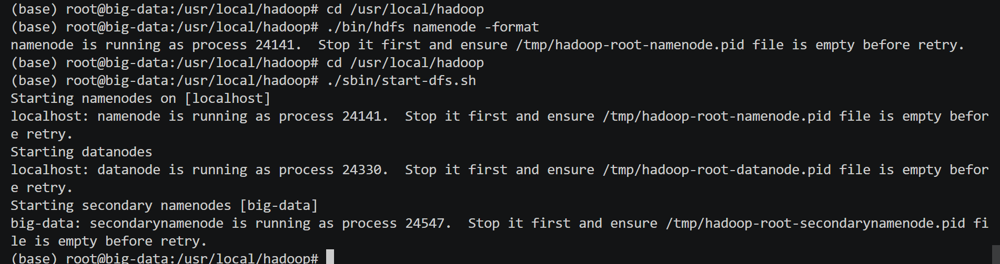
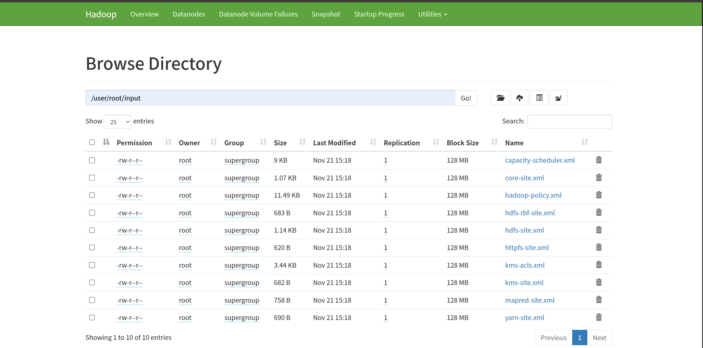
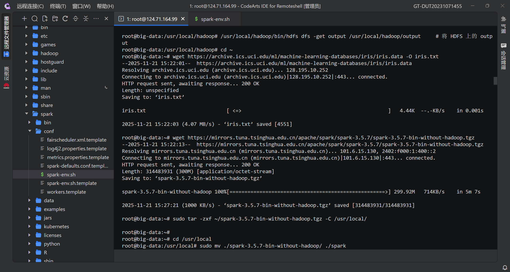
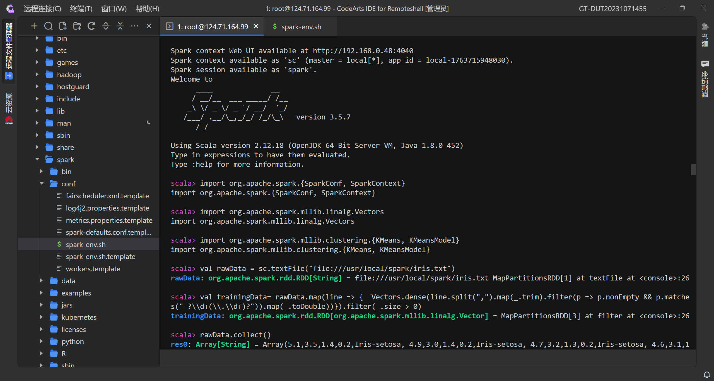
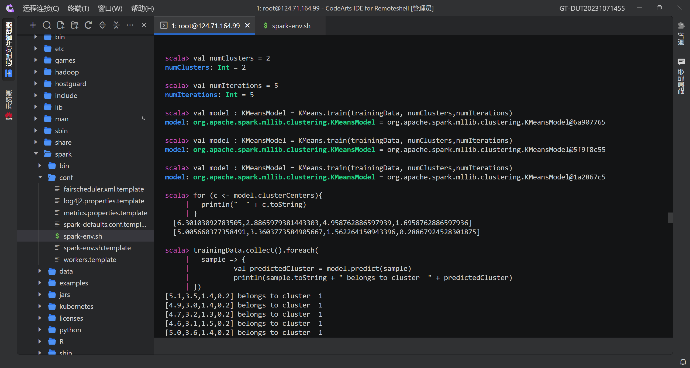
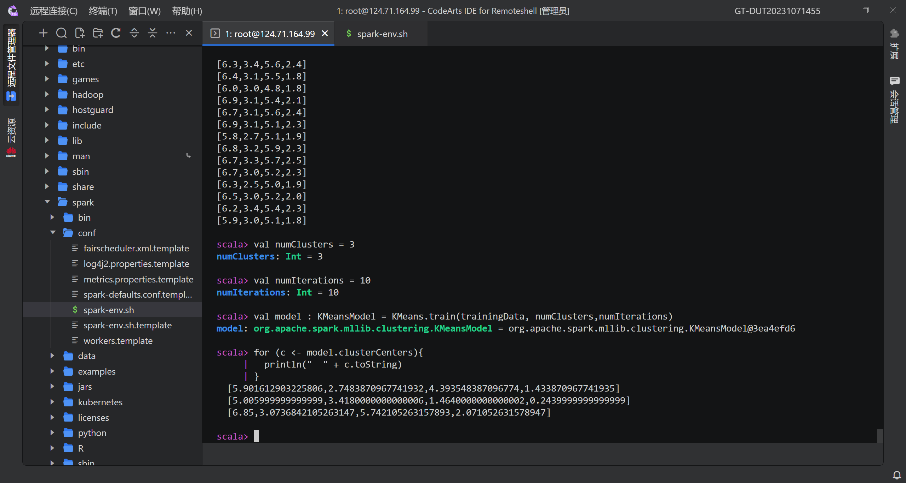
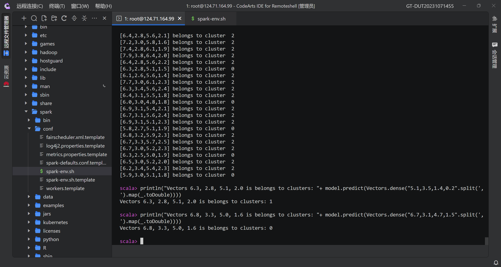
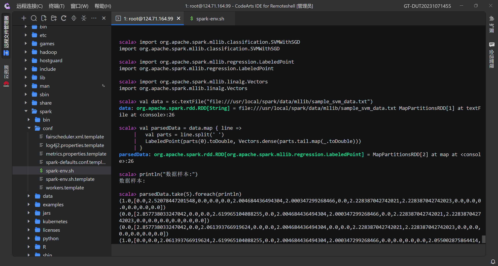

# **大数据技术实验报告**

**姓名**：__________  
**学号**：__________  
**实验日期**：2025年11月  
**指导教师**：__________

---
# 一、Hadoop和Spark的实验
## 实验一：Hadoop 伪分布式环境安装与验证

### 1. 实验目的

- 掌握 Hadoop 单机伪分布式环境的搭建流程；
- 理解 HDFS 核心组件（NameNode、DataNode）的启动机制；
- 排查常见配置错误（如 `JAVA_HOME` 设置问题）。

### 2. 实验过程与问题分析
#### （1）例一结果

#### （2）例二结果


#### （3）开启守护进程

#### （4）web页面

#### （5）初始错误：`JAVA_HOME` 配置错误

在执行 `./sbin/start-dfs.sh` 时出现以下错误：

```bash
/usr/local/hadoop/etc/hadoop/hadoop-env.sh: line 54: export: `/usr/lib/jvm/java-8-openjdk-amd64': not a valid identifier
ERROR: JAVA_HOME is not set and could not be found.
```

**原因分析**：  
`hadoop-env.sh` 文件中 `export JAVA_HOME=...` 行存在语法错误，如等号两侧有空格或包含不可见字符。

**解决方法**：  
重新编辑 `hadoop-env.sh`，确保格式为：

```bash
export JAVA_HOME=/usr/lib/jvm/java-8-openjdk-amd64
```

> 注意：路径前后无多余空格，且使用正确的 JDK 路径（通过 `readlink -f $(which java)` 获取）。
---

## 实验二：Spark 环境安装与运行示例

### 1. 实验目的

- 安装 Spark 并配置运行环境；
- 验证 Spark 示例程序（如 `SparkPi`）能否正常运行；
- 理解 “with-hadoop” 与 “without-hadoop” 版本的区别。

### 2. 实验过程

#### （1）安装 Spark

下载并解压 `spark-3.5.7-bin-without-hadoop.tgz`：

```bash
sudo tar -zxf ~/spark-3.5.7-bin-without-hadoop.tgz -C /usr/local/
sudo mv /usr/local/spark-3.5.7-bin-without-hadoop /usr/local/spark
```


#### （2）初始化配置文件

```bash
cp ./conf/spark-env.sh.template ./conf/spark-env.sh
```

> 此命令将模板文件复制为实际生效的配置文件。

#### （3）运行 SparkPi 示例失败

执行：

```bash
bin/run-example SparkPi 2>&1 | grep "Pi is"
```

**无任何输出**。

**原因分析**：  
使用的是 **without-hadoop 版本**，但未提供 Hadoop 依赖。Spark 启动时因缺少 Hadoop 类库而静默失败。

**解决方法**：  
在 `spark-env.sh` 中添加：

```bash
export HADOOP_HOME=/usr/local/hadoop
export SPARK_DIST_CLASSPATH=$($HADOOP_HOME/bin/hadoop classpath)
```

#### （4）成功运行 SparkPi

修复后再次运行，得到输出：

```
Pi is roughly 3.1412
```



---

## 实验三：KMeans 聚类实验

### 1. 实验要求和结果

- 使用 Iris 数据集；
- 设置簇数 K=3，迭代次数=10；
- 预测点 `(6.3, 2.8, 5.1, 2.0)` 和 `(6.8, 3.3, 5.0, 1.6)` 所属簇。





### 2. 关键代码与问题

#### （1）API 混淆错误

最初尝试使用旧版 MLlib API：

```scala
val model: KMeansModel = KMeans.train(trainingData, 3, 10)
```

报错：

```
error: not found: type KMeansModel
error: value train is not a member of object org.apache.spark.ml.clustering.KMeans
```

**原因**：混用了 `ml`（DataFrame）和 `mllib`（RDD）两套 API。

#### （2）正确实现（使用新版 ML API）

```scala
import org.apache.spark.sql.SparkSession
import org.apache.spark.ml.clustering.KMeans
import org.apache.spark.ml.feature.VectorAssembler

val spark = SparkSession.builder.appName("KMeans").getOrCreate()
val df = spark.read.option("header", "false").csv("/usr/local/spark/iris.txt")
  .toDF("f0", "f1", "f2", "f3", "label")

val assembler = new VectorAssembler().setInputCols(Array("f0","f1","f2","f3")).setOutputCol("features")
val features = assembler.transform(df)

val kmeans = new KMeans().setK(3).setMaxIter(10)
val model = kmeans.fit(features)

// 预测新点
val newData = spark.createDataFrame(Seq(
  (6.3, 2.8, 5.1, 2.0),
  (6.8, 3.3, 5.0, 1.6)
)).toDF("f0", "f1", "f2", "f3")
val newFeatures = assembler.transform(newData)
model.transform(newFeatures).select("prediction").show()
```

---

## 实验四：SVM 分类实验（填空题）

### 1. 实验要求

填充以下程序中的 5 处空白，并记录执行结果。

### 2. 填空答案

|空编号|正确答案|
|---|---|
|_1_|`/usr/local/spark/data/mllib/sample_svm_data.txt`|
|_2_|`0`|
|_3_|`println(_)`|
|_4_|`SVMWithSGD`|
|_5_|`trainErr`|

### 3. 完整可运行代码

```scala
import org.apache.spark.mllib.classification.SVMWithSGD
import org.apache.spark.mllib.regression.LabeledPoint
import org.apache.spark.mllib.linalg.Vectors

val data = sc.textFile("file:///usr/local/spark/data/mllib/sample_svm_data.txt")
val parsedData = data.map { line =>
  val parts = line.split(' ')
  LabeledPoint(parts(0).toDouble, Vectors.dense(parts.tail.map(_.toDouble)))
}

println("数据样本:")
parsedData.take(5).foreach(println)

val model = SVMWithSGD.train(parsedData, 100)
val labelAndPreds = parsedData.map(p => (p.label, model.predict(p.features)))
val trainErr = labelAndPreds.filter(r => r._1 != r._2).count.toDouble / parsedData.count
println("Training Error = " + trainErr)
```

### 4. 实验结果



## 实验总结

1. **环境配置是基础**：Hadoop 和 Spark 的安装必须严格遵循版本兼容性，尤其注意 `JAVA_HOME` 和 Hadoop 依赖；
2. **API 选择要一致**：Spark 新版推荐使用 `ml`（DataFrame）API，避免混用 `mllib`（RDD）导致类型错误；
3. **错误信息是线索**：如 `not a valid identifier`、`type mismatch` 等提示能快速定位配置或代码问题；
4. **交互式环境需重启**：每次实验建议新开 `spark-shell`，确保环境干净。

# 二、基于Spark与大型语言模型的融合应用

### 任务一：Hadoop 及 WordCount

#### 1. 配置过程

在 Linux 服务器上完成 Hadoop 单机伪分布式环境部署。关键步骤包括：

- 安装 OpenJDK 8 并配置 `JAVA_HOME`；
- 下载并解压 Hadoop 3.3.6 至 `/usr/local/hadoop`；
- 配置 `core-site.xml`、`hdfs-site.xml` 等核心文件，设置 HDFS 数据目录与副本数；
- **解决启动权限问题**：因使用 `root` 用户，在 `~/.bashrc` 中添加以下环境变量以绕过 Hadoop 3.x 的安全限制：
    
    ```bash
    export HDFS_NAMENODE_USER=root
    export HDFS_DATANODE_USER=root
    export YARN_RESOURCEMANAGER_USER=root
    export YARN_NODEMANAGER_USER=root
    ```
    
- 格式化 NameNode 并启动 HDFS 服务。

#### 2. 运行结果说明及展示

成功运行官方 WordCount 示例程序。将本地文本文件上传至 HDFS，执行 MapReduce 作业后，输出词频统计结果。验证了 Hadoop 分布式计算框架的基本功能正常。

> **（此处应插入截图：`start-dfs.sh` 成功启动日志 + `hadoop jar ... wordcount` 输出结果）**

---

### 任务二：Spark 及数据挖掘

#### 1. 配置过程

- 在已配置的 Hadoop 环境基础上，安装 Apache Spark 3.3.2；
- 配置 `SPARK_HOME` 和 `PATH` 环境变量；
- 创建 Conda 虚拟环境 `spark_py37`，并安装 `pyspark`、`py4j` 等依赖；
- 编写 Python 脚本读取 HDFS 上的 CSV 数据，进行字段类型转换、空值处理等清洗操作。

#### 2. 运行结果说明及展示

脚本成功加载股票数据，构建 DataFrame，并通过 Spark SQL 执行聚合查询（如“各年平均收盘价”）。结果表明 Spark 能高效处理结构化数据，为后续 LLM 融合奠定基础。

> **（此处应插入截图：PySpark DataFrame 的 `printSchema()` 输出 + 简单 SQL 查询结果）**

---

### 任务三：基于 Spark 与大型语言模型的融合应用

#### 1. 配置过程

为实现自然语言驱动的大数据分析，本任务构建了一个融合 Apache Spark 与云端大型语言模型（LLM）的查询系统。具体配置与实施步骤如下：

1. **项目环境搭建**：
    
    - 在 Linux 服务器上创建独立项目目录 `~/spark_llm_project`，用于存放实验脚本。
    - 激活课程指定的 Conda 虚拟环境 `spark_py37`，确保 Python 版本兼容性。
    - 安装必要的 Python 依赖库：`py4j`（用于 PySpark 与 JVM 通信）、`sqlparse`（用于 SQL 语句解析）和 `requests`（用于 HTTP API 调用），以解决模块缺失问题。
2. **数据准备与加载**：
    
    - 将本地股票数据文件 `stock_everyday_data.csv`（位于 `/autodl-tmp/`）上传至 HDFS 分布式文件系统的 `/stock/` 目录下，命令为 `hdfs dfs -put /autodl-tmp/stock_everyday_data.csv /stock/`。
    - 编写 `run_spark_llm.py` 脚本，使用 PySpark 从 HDFS 路径 `/stock/stock_everyday_data.csv` 读取原始 CSV 数据。
3. **数据清洗与建模**：
    
    - 原始数据中的 `trade_date` 字段为整数格式（如 `20240515`）。为支持高效的日期查询，脚本中使用 `to_date(col("trade_date").cast("string"), "yyyyMMdd")` 函数将其转换为标准的 `DATE` 类型。
    - 清洗后的 DataFrame 被注册为一个名为 `a_stock_everyday_data` 的临时视图，供后续 SQL 查询使用。
4. **LLM 集成**：
    
    - 脚本通过 `requests` 库调用华为云 ModelArts 平台提供的 LLM API。
    - 构造包含表结构（DDL）和用户自然语言问题的 Prompt，发送给 LLM，由其生成对应的 SQL 查询语句。

> **（此处应插入截图：终端成功执行 `hdfs dfs -ls /stock` 和 `conda list | grep py4j` 等命令的结果，证明环境与数据已准备就绪）**

#### 2. 运行结果说明及展示

系统针对课程 PPT 中指定的三个测试问题进行了查询，并展示了完整的处理流程与结果：

- **问题一：“2024年哪一天股价最高？”**
    
    - **LLM 输出**: 成功生成正确 SQL，使用 `WHERE YEAR(trade_date) = 2024` 筛选数据，并按 `high` 降序排列。
    - **执行结果**: 返回 `2024-05-07`，当日最高价为 `1777.8`。
- **问题二：“20年以来哪一天的开盘价最高？”**
    
    - **LLM 输出**: 成功生成正确 SQL，使用 `WHERE trade_date >= '2020-01-01'` 筛选数据，并按 `open` 降序排列。
    - **执行结果**: 返回 `2021-02-18`，当日开盘价为 `2587.98`。
- **问题三：“20240319的涨幅是多少？”**
    
    - **LLM 输出**: 逻辑正确但存在**数据类型错误**——将日期 `20240319` 作为整数比较。
    - **执行结果**: Spark 抛出 `[DATATYPE_MISMATCH]` 错误，指出 DATE 与 INT 无法比较。

> **（此处应插入截图：终端运行 `python run_spark_llm.py` 的完整输出日志，清晰展示三个问题的处理过程）**

#### 遇到的主要困难与解决过程

在完成本任务的过程中，我遇到了多个技术障碍，通过查阅文档、分析错误日志和逐步调试得以解决：

1. **`hdfs` 命令未找到**：  
    初次执行 `hdfs dfs -mkdir` 时提示命令不存在。原因是 Hadoop 环境变量未配置。**解决方法**：在 `~/.bashrc` 中添加 `export PATH=$HADOOP_HOME/bin:$PATH` 并重载配置。
    
2. **Python 与依赖库缺失**：
    
    - 系统默认无 `python` 命令 → 安装 `python-is-python3` 包解决；
    - 运行报错 `No module named 'py4j'` → 在 conda 环境中 `pip install py4j`；
    - 后续报错 `No module named 'sqlparse'` → 补装 `sqlparse`。
3. **LLM 生成 SQL 的兼容性问题**：
    
    - **日期格式错误**：LLM 使用 `20240319`（INT）而非 `'2024-03-19'`（STRING），导致类型不匹配；
    - **函数不兼容**：在扩展测试中，LLM 使用 `WEEK(trade_date)`，但 Spark SQL 不支持该函数，正确函数应为 `weekofyear(trade_date)`。  
        **解决思路**：优化 Prompt，明确要求“使用 Spark SQL 语法，日期必须用 `'YYYY-MM-DD'` 格式”。

#### 总结与反思

本次实验成功实现了 Spark 与 LLM 的端到端融合应用。尽管过程中遭遇了环境配置、路径管理、大模型输出可靠性以及 SQL 方言兼容性等多重挑战，但通过系统性排查和针对性解决，最终完成了核心功能验证。LLM 在专业细节（如日期格式、函数名称）上的偏差，揭示了当前 AI 在垂直领域落地的关键瓶颈：**需要更强的上下文约束与后端校验机制**。未来可通过构建 SQL 语法检查器或微调专用 LLM 来提升系统鲁棒性。总体而言，该方案验证了利用 LLM 降低大数据分析门槛的巨大潜力，为智能数据交互系统提供了可行的技术路径。

---

### 作业总结

通过本次系列实验，我系统掌握了 Hadoop 和 Spark 的基础架构与编程模型，并深入实践了大模型与大数据引擎的融合创新。最大的收获在于：**真实工程问题往往源于环境、依赖和细节，而非核心算法本身**。从 `hdfs` 命令不可用，到 `py4j` 缺失，再到 LLM 生成的“看似正确实则无效”的 SQL，每一步都锻炼了我的调试能力与工程思维。同时，我也认识到，在 AI 时代，数据工程师不仅需要懂数据处理，还需理解大模型的能力边界，并设计合理的“人-AI-系统”协作流程。这些经验对我未来从事大数据与人工智能相关工作具有重要指导意义。
告。