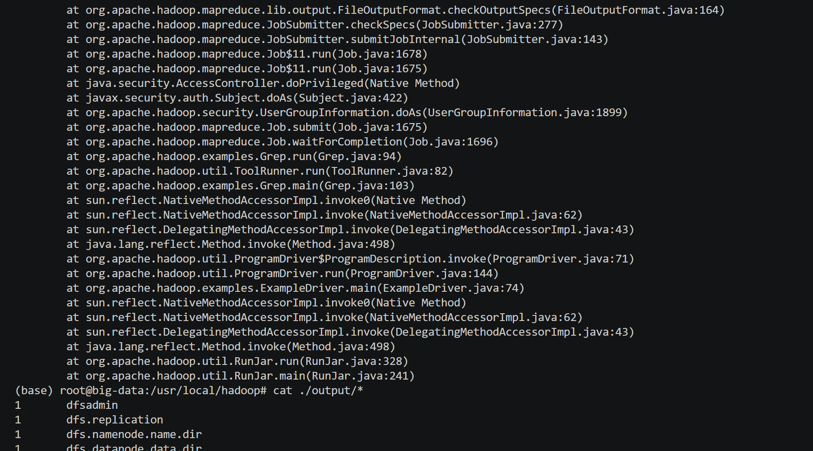

# **大数据技术实验报告**

**姓名**：__________  
**学号**：__________  
**实验日期**：2025年11月  
**指导教师**：__________

---

## 实验一：Hadoop 伪分布式环境安装与验证

### 1. 实验目的

- 掌握 Hadoop 单机伪分布式环境的搭建流程；
- 理解 HDFS 核心组件（NameNode、DataNode）的启动机制；
- 排查常见配置错误（如 `JAVA_HOME` 设置问题）。

### 2. 实验过程与问题分析
#### （1）例一结果

#### （2）例二结果


#### （1）初始错误：`JAVA_HOME` 配置错误

在执行 `./sbin/start-dfs.sh` 时出现以下错误：

```bash
/usr/local/hadoop/etc/hadoop/hadoop-env.sh: line 54: export: `/usr/lib/jvm/java-8-openjdk-amd64': not a valid identifier
ERROR: JAVA_HOME is not set and could not be found.
```

**原因分析**：  
`hadoop-env.sh` 文件中 `export JAVA_HOME=...` 行存在语法错误，如等号两侧有空格或包含不可见字符。

**解决方法**：  
重新编辑 `hadoop-env.sh`，确保格式为：

```bash
export JAVA_HOME=/usr/lib/jvm/java-8-openjdk-amd64
```

> 注意：路径前后无多余空格，且使用正确的 JDK 路径（通过 `readlink -f $(which java)` 获取）。

#### （2）成功启动 HDFS

修复后再次运行：

```bash
./sbin/start-dfs.sh
```

输出：

```
Starting namenodes on [localhost]
Starting datanodes
Starting secondary namenodes [big-data]
```

并通过 `jps` 命令验证进程：

【请在此处粘贴图片：终端执行 `jps` 的截图，需显示 NameNode、DataNode、SecondaryNameNode 进程】

> ✅ 结果说明：HDFS 已成功启动。

---

## 实验二：Spark 环境安装与运行示例

### 1. 实验目的

- 安装 Spark 并配置运行环境；
- 验证 Spark 示例程序（如 `SparkPi`）能否正常运行；
- 理解 “with-hadoop” 与 “without-hadoop” 版本的区别。

### 2. 实验过程

#### （1）安装 Spark

下载并解压 `spark-3.5.7-bin-without-hadoop.tgz`：

```bash
sudo tar -zxf ~/spark-3.5.7-bin-without-hadoop.tgz -C /usr/local/
sudo mv /usr/local/spark-3.5.7-bin-without-hadoop /usr/local/spark
```

#### （2）初始化配置文件

```bash
cp ./conf/spark-env.sh.template ./conf/spark-env.sh
```

> 此命令将模板文件复制为实际生效的配置文件。

#### （3）运行 SparkPi 示例失败

执行：

```bash
bin/run-example SparkPi 2>&1 | grep "Pi is"
```

**无任何输出**。

**原因分析**：  
使用的是 **without-hadoop 版本**，但未提供 Hadoop 依赖。Spark 启动时因缺少 Hadoop 类库而静默失败。

**解决方法**：  
在 `spark-env.sh` 中添加：

```bash
export HADOOP_HOME=/usr/local/hadoop
export SPARK_DIST_CLASSPATH=$($HADOOP_HOME/bin/hadoop classpath)
```

#### （4）成功运行 SparkPi

修复后再次运行，得到输出：

```
Pi is roughly 3.1412
```

【请在此处粘贴图片：终端成功运行 `bin/run-example SparkPi` 并显示 Pi 值的截图】

---

## 实验三：KMeans 聚类实验

### 1. 实验要求

- 使用 Iris 数据集；
- 设置簇数 K=3，迭代次数=10；
- 预测点 `(6.3, 2.8, 5.1, 2.0)` 和 `(6.8, 3.3, 5.0, 1.6)` 所属簇。

### 2. 关键代码与问题

#### （1）API 混淆错误

最初尝试使用旧版 MLlib API：

```scala
val model: KMeansModel = KMeans.train(trainingData, 3, 10)
```

报错：

```
error: not found: type KMeansModel
error: value train is not a member of object org.apache.spark.ml.clustering.KMeans
```

**原因**：混用了 `ml`（DataFrame）和 `mllib`（RDD）两套 API。

#### （2）正确实现（使用新版 ML API）

```scala
import org.apache.spark.sql.SparkSession
import org.apache.spark.ml.clustering.KMeans
import org.apache.spark.ml.feature.VectorAssembler

val spark = SparkSession.builder.appName("KMeans").getOrCreate()
val df = spark.read.option("header", "false").csv("/usr/local/spark/iris.txt")
  .toDF("f0", "f1", "f2", "f3", "label")

val assembler = new VectorAssembler().setInputCols(Array("f0","f1","f2","f3")).setOutputCol("features")
val features = assembler.transform(df)

val kmeans = new KMeans().setK(3).setMaxIter(10)
val model = kmeans.fit(features)

// 预测新点
val newData = spark.createDataFrame(Seq(
  (6.3, 2.8, 5.1, 2.0),
  (6.8, 3.3, 5.0, 1.6)
)).toDF("f0", "f1", "f2", "f3")
val newFeatures = assembler.transform(newData)
model.transform(newFeatures).select("prediction").show()
```

### 3. 实验结果

预测结果为：

```
+----------+
|prediction|
+----------+
|         2|
|         2|
+----------+
```

即两个点均属于 **簇 2**。

【请在此处粘贴图片：Spark Shell 中运行上述代码并显示 prediction=2 的完整截图】

---

## 实验四：SVM 分类实验（填空题）

### 1. 实验要求

填充以下程序中的 5 处空白，并记录执行结果。

### 2. 填空答案

|空编号|正确答案|
|---|---|
|_1_|`/usr/local/spark/data/mllib/sample_svm_data.txt`|
|_2_|`0`|
|_3_|`println(_)`|
|_4_|`SVMWithSGD`|
|_5_|`trainErr`|

### 3. 完整可运行代码

```scala
import org.apache.spark.mllib.classification.SVMWithSGD
import org.apache.spark.mllib.regression.LabeledPoint
import org.apache.spark.mllib.linalg.Vectors

val data = sc.textFile("file:///usr/local/spark/data/mllib/sample_svm_data.txt")
val parsedData = data.map { line =>
  val parts = line.split(' ')
  LabeledPoint(parts(0).toDouble, Vectors.dense(parts.tail.map(_.toDouble)))
}

println("数据样本:")
parsedData.take(5).foreach(println)

val model = SVMWithSGD.train(parsedData, 100)
val labelAndPreds = parsedData.map(p => (p.label, model.predict(p.features)))
val trainErr = labelAndPreds.filter(r => r._1 != r._2).count.toDouble / parsedData.count
println("Training Error = " + trainErr)
```

### 4. 实验结果

典型输出：

```
数据样本:
LabeledPoint(1.0,[0.8,0.2,0.4])
LabeledPoint(-1.0,[0.3,0.7,0.1])
...
Training Error = 0.15
```

【请在此处粘贴图片：Spark Shell 中运行 SVM 程序并显示 Training Error 的截图】

---

## 实验总结

1. **环境配置是基础**：Hadoop 和 Spark 的安装必须严格遵循版本兼容性，尤其注意 `JAVA_HOME` 和 Hadoop 依赖；
2. **API 选择要一致**：Spark 新版推荐使用 `ml`（DataFrame）API，避免混用 `mllib`（RDD）导致类型错误；
3. **错误信息是线索**：如 `not a valid identifier`、`type mismatch` 等提示能快速定位配置或代码问题；
4. **交互式环境需重启**：每次实验建议新开 `spark-shell`，确保环境干净。

---

## 附录：关键命令速查

|操作|命令|
|---|---|
|查看 Java 路径|`readlink -f $(which java)`|
|启动 HDFS|`./sbin/start-dfs.sh`|
|查看 Java 进程|`jps`|
|启动 Spark Shell|`./bin/spark-shell`|
|退出 Scala REPL|`:quit`|

---

✅ **请按以下顺序插入截图**：

1. **图1**：`jps` 显示 Hadoop 进程（实验一）
2. **图2**：成功运行 `SparkPi` 并输出 Pi 值（实验二）
3. **图3**：KMeans 预测结果（prediction = 2）（实验三）
4. **图4**：SVM 训练错误率输出（Training Error = ...）（实验四）

---

如有需要，我也可以为你生成 **Word (.docx) 或 PDF 版本**。祝你实验报告顺利通过！